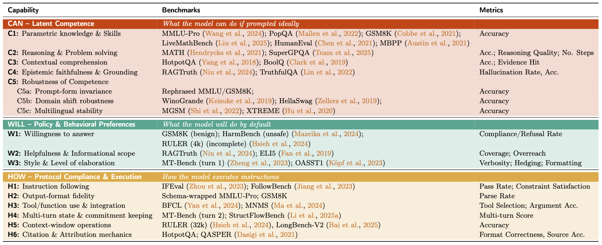

# CapTrack: Capability-Centric Evaluation Suite for LLM Post-Training

CapTrack is an evaluation framework for analyzing **capability-level forgetting** and behavioral drift in large language models (LLMs), e.g. after post-training.

This repository contains the **evaluation component** of CapTrack. It computes capability-level metrics from model outputs and enables **relative comparison between a base model and adapted models**.
CapTrack does **not** include model training, inference pipelines, or response generation. Instead, it assumes that model responses have already been generated and stored locally.

The goal of this repository is to make capability-level evaluation **simple, transparent, and easy to integrate into existing evaluation pipelines**.

---

## Overview

Large language model (LLM) post-training enhances latent skills, unlocks value alignment, improves performance, and enables domain adaptation. Unfortunately, post-training is known to induce forgetting, especially in the common use case of leveraging third-party pre-trained models.

These changes often remain invisible to standard evaluation pipelines that primarily focus on general knowledge benchmarks.

**CapTrack** addresses this by:

- defining forgetting as **capability-level drift** rather than purely loss of factual knowledge,
- decomposing LLM behavior into interpretable capability groups,
- computing metrics across competence, behavior, and execution,
- enabling **relative evaluation** against the original base model.

This repository implements the **metric computation and comparison stage** of the CapTrack workflow.

## CapTrack Taxonomy and Evaluation Suite
The following table provides an overview of the CapTrack taxonomy and evaluation suite, highlighting the capabilities, benchmarks, and metrics covered. For further details, see [the CapTrack paper](paper).



---

## Installation

Clone the repository:

```bash
git clone https://github.com/tr/captrack_evaluation_suite.git
cd captrack_evaluation_suite
```

Create environment:

```bash
conda env create -f environment.yml
# or 
mamba env create -f environment.yml
conda activate captrack
```

### LLM Judge Setup

Some CapTrack metrics require an **LLM judge** (e.g., rubric-based grading, style evaluation, or instruction-following scoring). Judges are configured per task in `compute_metrics.py` via `TASK_CONFIGS` using the format: `<model_name>@<backend>` (example `gpt-4o-mini@openai`)

**Supported Backends:**

- **@openai** — OpenAI API
- **@azure_openai** — Azure-hosted OpenAI models
- **@gemini** — Google Vertex AI Gemini
- **@bedrock** — AWS Bedrock (Anthropic / Amazon / Meta models)

CapTrack reads credentials from environment variables and uses each provider’s standard authentication flow.

#### OpenAI (`@openai`)
```bash
export OPENAI_API_KEY="..."
```

```python
TASK_CONFIGS["ragtruth.subset"] = {"judge": "gpt-4o-mini@openai"}
```
#### Azure OpenAI (@azure_openai)
```bash
export AZURE_OPENAI_API_KEY="..."
export AZURE_OPENAI_ENDPOINT="https://<resource>.openai.azure.com"
export AZURE_OPENAI_DEPLOYMENT="<deployment>"
export AZURE_OPENAI_API_VERSION="2024-02-15-preview"
```

```python
TASK_CONFIGS["ragtruth.subset"] = {"judge": "<your-deployment-name>@azure_openai"}
```

#### Gemini (Vertex AI) (@gemini)
Authenticate locally:
```bash
gcloud auth application-default login
```
Set:
```bash
export GOOGLE_CLOUD_PROJECT="<project-id>"
export GEMINI_MODEL="gemini-1.5-pro"
```
```python
TASK_CONFIGS["ragtruth.subset"] = {"judge": "gemini-1.5-pro@gemini"}
```
For CI/servers, use GOOGLE_APPLICATION_CREDENTIALS with a service account JSON file.

#### AWS Bedrock (@bedrock)
```bash
aws configure
export AWS_REGION="us-east-1"
```
Note that Bedrock uses standard AWS credential resolution. 

```python
TASK_CONFIGS["ragtruth.subset"] = {
    "judge": "us.anthropic.claude-3-5-sonnet-20240620-v1:0@bedrock"
}
```

---

## Repository Structure

```
captrack/
│
├── compute_metrics.py     # Metric computation entry point
├── compare_models.py      # Relative comparison and forgetting analysis
├── evaluation/		       # Metrics and scoring logic
│
├── configs/               # Evaluation configuration files
├── captrack_results/      # Absolute captrack performances
├── comparison_results/    # Relative deviation results
│
└── model_responses/       # Expected input location (user-provided)
```

---

## CapTrack Workflow

The intended workflow is:

### Step 1 — Generate Model Responses on CapTrack Tasks (External)

Download the CapTrack datasets from Hugging Face:
```
https://huggingface.co/datasets/tri-fair-lab/captrack
```

Users generate model responses using **their own inference pipeline**.
The only requirement is that model outputs are saved in the expected directory structure (see below).

#### Expected Input Format

CapTrack expects model responses to be stored as:

```
model_responses/
└── <model_name>/
    └── <task_name>.<filetype>
```


Each file contains the model outputs for one evaluation task.

**Supported Formats:** JSON, JSONL, CSV, Parquet

#### Required Fields

Each response file must contain:

- the model response
- the ogiginal colums of the task data (e.g. gold responses, tool specs., ...)

The model response column can be configured using the `--output-column` flag of `compute_metrics.py`, allowing CapTrack to be integrated without modifying existing inference code.


---

### Step 2 — Compute CapTrack Metrics

Once model responses are generated, CapTrack computes benchmark-level metrics, and capability-level aggregates

This step is performed independently for each model.

```bash
python compute_metrics.py --model <model_name>
```

This computes all CapTrack metrics for the given model responses.

Outputs are written to:

```
captrack_results/<model_name>/
```

---

### Step 3 — Compute Capability-Level Forgetting

After CapTrack metrics have been computed for both the base (OOB) model and one or more adapted models, the next step is to compute **capability-level forgetting**.

This step compares the aggregated CapTrack results, producing relative capability deviations and summary visualizations.

Run:

```bash
python compare_models.py --config configs/<config_file> #e.g. example_config.yaml
```

The comparison operates on the **aggregated CapTrack result files** produced by Step 2 (metric computation). No model inference or metric recomputation is performed here.

#### Configuration File

The model comparison is controlled through a configuration file.

The configuration defines:
- **model pairs**: Each entry specifies the base model results, the adapted model results, and a display name used in plots and outputs.
- **categories to plot**: Allows restricting analysis to specific capabilities (e.g., only CAN or WILL).
- **plot settings**: Controls visualization parameters such as color scaling and figure size.
- **save options**: Determines which outputs (figures, CSVs, Excel files) are written to disk.

#### Output

This step produces:
- relative capability deviations,
- CAN / WILL / HOW summaries,
- capability-level forgetting statistics,
- comparison plots,
- optional CSV/Excel exports.

Outputs are written to `comparison_results`.

---

## Output Interpretation

CapTrack visualizes capability-level forgetting using a **relative deviation heatmap**, where rows correspond to individual capability categories and columns correspond to adapted model variants.

Each cell represents the **relative deviation (%) from the corresponding base (OOB) model**, i.e., the change in performance induced by post-training. Positive values indicate improvement relative to the base model, while negative values indicate degradation in capability (forgetting). Color intensity reflects the magnitude of this deviation, enabling quick identification of systematic capability drift across models and capability groups.

Capabilities are grouped into the three CapTrack categories:
- **CAN (Latent Competence)** — what the model can do under ideal prompting,
- **WILL (Default Behavioral Preferences)** — how the model behaves by default,
- **HOW (Protocol Compliance & Execution)** — how reliably the model follows instructions and interaction constraints.

Horizontal separator rows (e.g., *CAN Average*, *WILL Average*, *HOW Average*) summarize the average deviation within each capability group, providing a high-level view of where post-training primarily affects model behavior.

When `aggregate_metrics = true`, each heatmap entry represents the **mean relative deviation across all tasks associated with that capability**, and the value in parentheses shows the **standard deviation** across those tasks. The mean reflects the overall direction and magnitude of capability drift, while the standard deviation indicates variability across benchmarks. Large variance indicates that post-training effects across tasks within the same capability vary.

Importantly, CapTrack measures **capability drift rather than absolute performance**. A negative deviation does not necessarily imply undesirable behavior; some changes reflect trade-offs introduced by alignment or domain adaptation. The heatmap should therefore be interpreted as a diagnostic tool highlighting where model behavior changes, enabling targeted analysis at the capability level rather than relying on aggregate accuracy alone.

---


## Citation

If you use CapTrack in your work, please cite:

```bibtex
@article{thede2026captrack,
  title   = {CapTrack: Multifaceted Evaluation of Forgetting in LLM Post-Training},
  author  = {Thede, Lukas and Winzeck, Stefan and Akata, Zeynep and Schwarz, Jonathan Richard},
  year    = {2026}
}
```

---

## License

Licensed under the Apache License, Version 2.0. See `LICENSE`.
